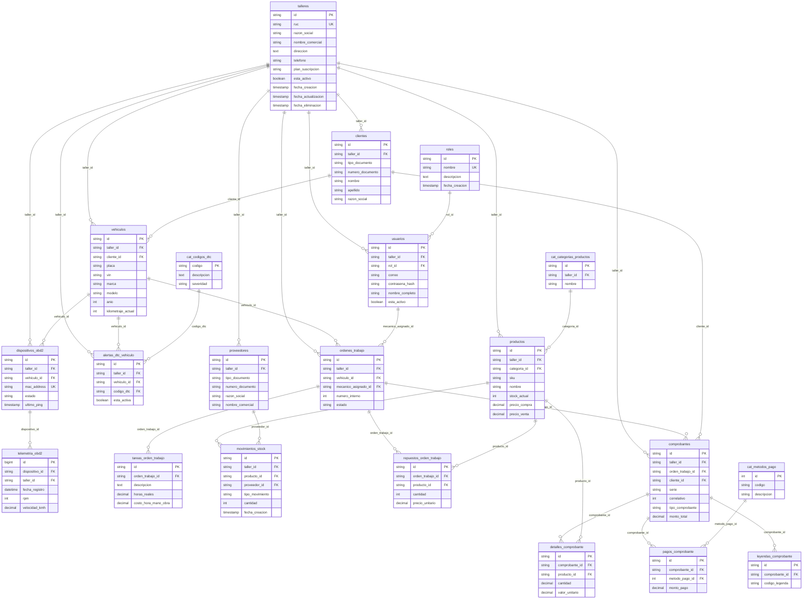

# 🗄️ Arquitectura Detallada de Base de Datos - Andeva X

**Motor:** MySQL 8.0+ | **Filosofía:** SaaS Multi-Tenant | **Contexto Legal:** SUNAT (Perú)

A continuación, se detalla tabla por tabla, campo por campo, la justificación técnica y de negocio de este esquema.

## Diagrama de Base de Datos (DBML)

## MÓDULO 1: Núcleo (Core & Security)

### 1.1 `talleres`
**Propósito:** Entidad raíz (Padre de todo). Representa la empresa que paga la suscripción del software.
*   `id CHAR(36)`: **UUIDv4.** Se evita el `AUTO_INCREMENT` (1, 2, 3) para que un dueño de taller no pueda adivinar el ID de otro taller y vulnerar sus datos modificando la URL.
*   `ruc VARCHAR(11) UNIQUE`: En Perú, el RUC es la clave natural y única por excelencia. Se usa como validación estricta de negocio.
*   `razon_social / nombre_comercial`: Separación tributaria estándar. "Juan Pérez EIRL" vs "Taller El Motor".
*   `plan_suscripcion ENUM`: Permite escalar el negocio (Free, Pro, Enterprise) bloqueando features desde la base de datos si es necesario.
*   `fecha_eliminacion TIMESTAMP NULL`: **Soft Delete.** Si un taller se da de baja, no se hace `DELETE` porque destruiría años de historial de facturas tributarias.

### 1.2 `roles`
**Propósito:** Catálogo estático de permisos (RBAC - Control de Acceso Basado en Roles).
*   `nombre VARCHAR(50) UNIQUE`: Nombres fijos como 'ADMINISTRADOR', 'MECANICO', 'RECEPCIONISTA'.
*   *¿Por qué una tabla separada y no un ENUM en `usuarios`?* Porque los roles pueden requerir permisos granulares en el futuro. Un ENUM es rígido; una tabla permite agregar intermediarios o nuevos roles sin alterar la estructura de `usuarios`.

### 1.3 `usuarios`
**Propósito:** Los trabajadores del taller que manipulan el sistema (no los clientes).
*   `taller_id CHAR(36) FK`: Garantiza el aislamiento multi-tenant.
*   `correo VARCHAR(100)`: **Restricción Única Compuesta `uk_taller_correo (taller_id, correo)`.** *¿Por qué no es único globalmente?* Porque si "Carlos" es mecánico del Taller A y luego se cambia al Taller B, su correo debe poder existir en ambos talleres como registros independientes.
*   `contrasena_hash VARCHAR(255)`: El backend *jamás* guardará la contraseña real. Solo el hash (ej. Bcrypt).
*   `fecha_eliminacion`: **Soft Delete crítico.** Si Carlos renuncia, sus Órdenes de Trabajo pasadas deben mantener "Quién reparó el auto". Si borramos al usuario, perdemos la trazabilidad de las reparaciones.

---

## MÓDULO 2: Flota (Clientes y Vehículos)

### 2.1 `clientes`
**Propósito:** Dueños de los vehículos. Ellos no se logean, solo reciben notificaciones.
*   `tipo_documento / numero_documento`: Acepta DNI, RUC, CE, Pasaporte. Se usa una **Unique Key compuesta `(taller_id, tipo_documento, numero_documento)`**. *¿Por qué?* Porque en el Taller A puedo tener un cliente DNI 12345678, y en el Taller B otro cliente distinto con el mismo DNI.
*   `razon_social VARCHAR(150)`: Solo se utiliza y se exige si `tipo_documento` es 'RUC'.

### 2.2 `vehiculos`
**Propósito:** Los activos sobre los que se trabaja.
*   `placa VARCHAR(7)`: **Unique Key compuesta `uk_taller_placa (taller_id, placa)`.** *¿Por qué no única global?* Si un cliente se lleva su auto a otro taller que usa Andeva X, la placa debe poder registrarse ahí. No podemos bloquearlo globalmente.
*   `vin VARCHAR(17) UNIQUE`: El Número de Identificación del Vehículo (Chasis) sí es único a nivel mundial. Se pone único global para evitar duplicados exactos de autos clonados o errores de tipeo masivos.
*   `cliente_id FK ON DELETE RESTRICT`: **Seguridad máxima.** Impide que un programador elimine un cliente si este tiene autos asociados. El sistema obliga a desvincular los autos primero.

---

## MÓDULO 3: IoT (Hardware OBD2 y Telemetría)

### 3.1 `dispositivos_obd2`
**Propósito:** Los chips físicos que se conectan al puerto del auto.
*   `mac_address VARCHAR(17) UNIQUE`: Identificador físico inmutable del chip Bluetooth/WiFi.
*   `vehiculo_id FK ON DELETE SET NULL`: **Lógica de negocio vital.** El chip *le pertenece al taller*, no al cliente. Si el cliente se lleva su auto (y se elimina/desafilia), el chip queda huérfano (`NULL`) pero sigue activo en el taller para ser reasignado a otro vehículo.

### 3.2 `cat_codigos_dtc`
**Propósito:** Diccionario de códigos de falla (Ej: P0300).
*   `codigo VARCHAR(5) PRIMARY KEY`: Estandarización global OBD2. *¿Por qué una tabla y no un texto libre?* Para evitar que un mecánico escriba "Fallo de chispa" por un lado y "P0300" por otro, rompiendo los algoritmos de predicción de la IA.

### 3.3 `alertas_dtc_vehiculo`
**Propósito:** El historial médico del vehículo (Fallas detectadas).
*   `esta_activa BOOLEAN`: Se pone en `FALSE` cuando el mecánico limpia el código. *¿Por qué no borrar la fila?* Para que la Vista `v_salud_vehiculo_iot` pueda calcular la recurrentencia ("Este auto ha fallado 4 veces de la misma cosa este año").

### 3.4 `telemetria_obd2` ⚡ (Tabla de Ultra Alto Rendimiento)
**Propósito:** Ingesta masiva de datos del chip (RPM, Temperatura, Velocidad cada segundo).
*   `id BIGINT AUTO_INCREMENT`: **Decisión de performance extrema.** Generar un UUIDv4 por cada fila a miles de inserts por segundo destruiría el CPU del servidor. Se usa BIGINT.
*   `fecha_registro DATETIME`: **Decisión de arquitectura.** Se eligió `DATETIME` sobre `TIMESTAMP` porque `TIMESTAMP` hace conversiones de zona horaria internas que matan el rendimiento, y tiene un límite duro (Año 2038).
*   **NO TIENE FOREIGN KEYS:** Limitante estricta de MySQL: Tablas particionadas no aceptan FKs. Se usaron Índices normales para mantener la velocidad de cruce.
*   **`PARTITION BY RANGE COLUMNS (fecha_registro)`:** *¿Por qué esto es genial?* Si la tabla tiene 100 millones de filas y consultas los datos de "Hoy", MySQL en lugar de leer los 100 millones, va directamente a la partición de "Hoy" (que pesa unos pocos MB). Acelera las lecturas en un 99%.

---

## MÓDULO 4: Operaciones (Órdenes de Trabajo)

### 4.1 `ordenes_trabajo`
**Propósito:** El corazón operativo. Une al cliente, vehículo, mecánico y repuestos.
*   `numero_interno INT`: Correlativo legible para el humano (Ej: OT-0001). Unique por taller.
*   `estado ENUM`: Máquina de estados estricta. Evita que se salten pasos (Ej: No se puede "Facturar" si no está "Terminada").
*   `mecanico_asignado_id FK ON DELETE SET NULL`: Si el mecánico es despedido/borrado del sistema, la Orden de Trabajo histórica **no se elimina**, simplemente el campo queda nulo (Asumiendo "Mecánico desconocido" en la UI).

### 4.2 `tareas_orden_trabajo`
**Propósito:** El detalle de la mano de obra.
*   `costo_total_mano_obra DECIMAL GENERATED ALWAYS AS (...)`: **Columna Virtual.** *¿Por qué calcularlo en la BD y no en el Backend?* Para evitar el error de los centavos flotantes (ej: que Node.js calcule S/. 10.10 y la BD S/. 10.09 por redondeos). Si lo calcula MySQL al hacer el INSERT, el dato es la "única verdad".

---

## MÓDULO 5: Inventario y Proveedores

### 5.1 `cat_categorias_productos`
**Propósito:** Agrupación lógica (Aceites, Filtros, Pastillas).
*   `nombre VARCHAR(100) UNIQUE_compuesta`: Unique por taller para evitar duplicados internos.

### 5.2 `productos`
**Propósito:** El catálogo de lo que se vende/gasta.
*   `sku VARCHAR(50)`: Código interno corto (Ej: "ACE-5W-1L"). Para búsqueda rápida humana.
*   `codigo_barras VARCHAR(50)`: Para lectores láser USB en mostrador.
*   `stock_actual INT`: **Denormalización a propósito.** En teoría de BD pura esto es un error (se debería calcular sumando el histórico). En la vida real, si un mecánico abre la app y la BD tiene que sumar 50,000 registros para decirle "Hay 2 filtros", la app se congela. Se guarda aquí y se actualiza vía transacción.
*   `precio_compra / precio_venta`: Ambos obligatorios. Sin el precio de compra, la vista `v_rentabilidad_ordenes_trabajo` no podría calcular si el taller gana o pierde dinero.

### 5.3 `proveedores`
**Propósito:** A quién le debemos dinero.
*   `dias_credito INT`: *Contexto Peruano.* El negocio de repuestos funciona al fiado. Permite saber que le debemos al proveedor a 15 o 30 días.
*   `linea_credito_limite DECIMAL`: Tope de deuda. Sirve para que, en el futuro, el backend bloquee compras si el taller ya le debe demasiado a ese distribuidor.

### 5.4 `movimientos_stock` 🛡️ (El Libro Contable Inmutable)
**Propósito:** Registrar TODO lo que entra y sale. **Regla de oro: Aquí SOLO se hace INSERT. Nunca UPDATE ni DELETE.**
*   `tipo_movimiento ENUM`: Controla el flujo (`ENTRADA`, `SALIDA`, `AJUSTE`, `DEVOLUCION`).
*   `cantidad INT`: *¿Por qué permite negativos?* Para facilitar la contabilidad. Si haces un `SUM(cantidad)` y da `-5`, sabes que salieron 5 unidades sin tener que hacer `SUM(CASE WHEN tipo='SALIDA'...)`.
*   `proveedor_id FK NULL`: Solo se llena si es una `ENTRADA`. Si es una `SALIDA` hacia una OT, queda nulo.

### 5.5 `repuestos_orden_trabajo`
**Propósito:** El puente entre el Inventario y la Orden de Trabajo.
*   `precio_total GENERATED`: Otra columna virtual infalible (`cantidad * precio_unitario`).

---

## MÓDULO 6: Facturación (Contexto SUNAT - Perú)

### 6.1 `cat_metodos_pago`
**Propósito:** Catálogo fijo (Efectivo, Yape, Tarjeta).
*   *¿Por qué no un ENUM en la tabla de pagos?* Porque la SUNAT cambia códigos o se agregan nuevos medios (como Plin). Una tabla permite actualizaciones calientes sin alterar la estructura de la tabla de pagos.

### 6.2 `comprobantes`
**Propósito:** La cabecera de la Factura/Boleta (Estructura UBL 2.1 estricta).
*   `serie / correlativo`: Ej: F001-1. **Unique compuesto por taller** (El Taller A puede tener F001-1 y el Taller B también).
*   `tipo_comprobante ENUM('01','03'...)`: Códigos duros de SUNAT (01=Factura, 03=Boleta, 07=NC, 08=ND).
*   `subtotal_gravadas / subtotal_inafectas / subtotal_exoneradas`: *¿Por qué separados?* Porque el XML que se le envía a la SUNAT exige que estos montos vayan en etiquetas XML distintas y separadas. Si lo juntamos, el XML rechaza.
*   `estado_sunat ENUM`: Controla el flujo asíncrono con el gobierno (`PENDIENTE` -> `ENVIADO` -> `ACEPTADO` / `RECHAZADO`).

### 6.3 `detalles_comprobante`
**Propósito:** El cuerpo de la factura (Qué se vendió).
*   `codigo_unidad_medida CHAR(3)`: Catálogo SUNAT N° 03 (NIU=Unidad, KGM=Kilogramo, LTR=Litro). Se usa `CHAR(3)` para cumplimiento tributario exacto.
*   `codigo_afectacion CHAR(2)`: Catálogo SUNAT N° 06 (10=Gravado IGV, 20=Exonerado, 30=Inafecto).
*   `monto_igv / valor_total_linea GENERATED`: Cálculos infalibles delegados a MySQL para que el XML enviado a SUNAT nunca tenga errores de centavos.

### 6.4 `leyendas_comprobante`
**Propósito:** Textos legales peruanos obligatorios.
*   *¿Por qué una tabla separada?* Porque una factura puede requerir múltiples leyendas simultáneas (Ej: "1000 Soles son ..." y "Operación sujeta a detracción"). Una tabla N:M (Uno a Muchos) es la única forma limpia de hacerlo.

### 6.5 `pagos_comprobante`
**Propósito:** Registrar cómo pagó el cliente.
*   Permite **pagos fraccionados** (Ej: S/. 100 en Yape, S/. 50 en Efectivo en la misma boleta). `referencia_transaccion` guarda el voucher de Yape.
